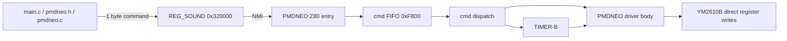

# PMDNEO 自作 Z80 driver 設計 (= nullsound 非依存、ハード直叩き、OPNB 全制御)
ファイルパス: `docs/design/pmdneo_self_contained_driver.md`
SubF 以降の authoritative design doc; `phase2_driver_plan.md` SubF 以降を supersede
日付: 2026-05-08 (revision 1)
著者: 越川将人 (M.Koshikawa.) — Claude Code + Codex 協働草稿
---
### 1. 位置付け (Positioning)
本書は PMDNEO Phase 2 SubF 以降の Z80 driver 再設計基準である。
対象は nullsound 依存を撤去した self-contained driver である。
Z80 ROM、Z80 SRAM、OPNB レジスタ制御を PMDNEO が完全所有する。
`docs/design/phase2_driver_plan.md` は SubA から SubE までの経緯資料として残す。
SubF 以降の実装判断、移行順序、検証規律は本書を正とする。
Phase 2 SubF-1 の 9 時間 spike は、音楽 driver の不具合ではなく配置設計の不具合だった。
nullsound の `.area DATA` が Z80 sound RAM を 1940 byte 消費していた。
NEOGEO の Z80 sound RAM は 0xF800-0xFFFF の 2048 byte しかない。
この時点で nullsound だけで 95% を占有していた。
一方、PMDNEO 側の `.area BSS` は build 設定で明示配置されていなかった。
`build.mk` は `-b DATA=0xf800` のみを指定していた。
そのため BSS は RAM ではなく ROM 空間 0x028B 以降に配置された。
Z80 は `driver_tempo_d`、`driver_subtick_acc`、`driver_song_ready` を書いた。
しかし実体は ROM 側なので、書込み命令は走っても値は保持されなかった。
`pmdneo_irq_count` と `part_workarea` も同じく永続化されなかった。
観測証跡は明確である。
`0x28 keyon writes 0 / 891 entries`。
`driver_subtick_acc fixed at 0x05`。
`BSS placed at 0x028B`。
この組合せにより sub-tick gating accumulator は overflow しなかった。
`pmdneo_song_main` は dispatch されず、`fmmain` は実行されなかった。
その結果、MAME の YMFM trace に `0x28 = 0xF1` keyon write は出なかった。
gngeo は lenient なため偶然鳴ったが、MAME は strict に bug を露出した。
この失敗は「依存 framework の RAM 予約」と「driver state 所有権」の衝突である。
2026-05-08 の user 哲学は次である。
「Always failing because of dependency. The real PMD driver hits hardware directly, no frameworks. That is the true way.」
本書はこの哲学を技術設計へ落とす。
PMD V4.8s 作者 梶原正裕 氏の X68000/PC-98 driver 流儀も同じ方向にある。
PMD は抽象 layer ではなく、対象環境の音源 chip を直接制御する driver である。
PMDNEO も NEOGEO 上の OPNB (YM2610B) を直接制御する。
ADR-0003「PMD 互換 driver 新規実装」の補足文書として扱う。
ADR-0003 を supersede するか amendment とするかは user 判断保留である。
本書はその判断前でも実装基準として有効である。
---
### 2. 設計原則 (Design Principles)
M68K 側では ngdevkit C API を toolchain として使う。
これは framework 依存ではなく、NEOGEO build と BIOS helper の使用である。
BIOS call、video、palette、sprite helper は使用してよい。
`REG_SOUND` への 1 byte command 書込みは NEOGEO hardware protocol である。
M68K 側は player UI と command 発行に集中する。
M68K 側に PMD driver state machine は置かない。
Z80 側では nullsound を完全撤去する。
`nullsound.lib` を link しない。
`helpers.inc`、`ports.inc`、`ym2610.inc` 由来の必要定数は PMDNEO 側で保持する。
PMDNEO は Z80 ROM 100% を所有する。
PMDNEO は Z80 SRAM 100% を所有する。
0xF800-0xFFFF の全 byte 配置は PMDNEO 文書と source で説明できる状態にする。
OPNB (YM2610B) の全 register、全 channel を直接 register write で制御する。
FM 6ch、SSG 3ch、ADPCM-B 1ch、ADPCM-A 6ch を同じ chip helper 経由で扱う。
YM2610 無印で無音になる FM ch 1/4 も register write としては許容する。
楽曲運用は ADR-0001 の Part B/C/E/F 方針に従う。
driver source は `src/driver/` 単一 root に置く。
これは `project_pmdaes_embedded_extractable` の「driver を抽出可能に保つ」方針と整合する。
vendor 側 source へ PMDNEO 固有 patch を積まない。
便利 wrapper に処理を隠さない。
全機能は Z80 code として entry から chip write まで end-to-end で読める必要がある。
便宜上の小 routine は許すが、所有権は PMDNEO にある。
外部 framework の hidden state に tempo、IRQ、FIFO、chip context を預けない。
---
### 3. レイヤー分離 (Layer Separation)

M68K 側は `main.c` と新規 `pmdneo.h` / `pmdneo.c` を持つ。
`pmdneo.c` は command 送出 helper であり、driver 本体ではない。
通信境界は `REG_SOUND` port 0x320000 である。
NEOGEO hardware 仕様として M68K から 1 byte 書く。
Z80 側では対応する IO port 0xC0 を読む。
Z80 側は PMDNEO 入口、cmd FIFO、chip helper、TIMER、driver 本体を持つ。
M68K と Z80 の間で symbol を共有しない。
M68K は Z80 の `driver_song_ready` や `part_workarea` を知らない。
Z80 は M68K の C 関数や変数を知らない。
境界規律は port level handshake のみである。
この分離により、M68K 側 UI と Z80 driver は独立して検証できる。
また Z80 driver は将来別 project へ抽出しやすい。
---
### 4. M68K side API 仕様
公開 header は `include/pmdneo.h` を基本位置とする。
既存 tree の都合で初期実装を `src/main/pmdneo.h` に置く場合も、最終 API 名は同じにする。
command 番号は header で定数化する。
```c
#pragma once
#include <stdint.h>
#define PMDNEO_CMD_NOP        0x00
#define PMDNEO_CMD_ROM_SWITCH 0x01
#define PMDNEO_CMD_PLAY_SONG  0x02
#define PMDNEO_CMD_RESET      0x03
#define PMDNEO_CMD_FADE_OUT   0x04
#define PMDNEO_CMD_BEAT       0x05
void pmdneo_reset(void);
void pmdneo_play_song(uint8_t id);
void pmdneo_fade_out(void);
void pmdneo_play_beat(void);
void pmdneo_wait_vblanks(uint8_t frames);
```
`src/main/pmdneo.c` は `*REG_SOUND = N` wrapper だけを持つ。
起動直後は Z80 NMI と mainloop 再開に猶予が要るため vblank wait helper を持つ。
`pmdneo_reset()` は cmd 3 を発行し、複数 vblank 待つ。
`pmdneo_play_song(uint8_t id)` は Phase 2 では cmd 2 dispatcher とする。
曲 ID を本当に渡す protocol は Phase 3 以降で拡張する。
`pmdneo_fade_out()` は cmd 4 を発行する。
`pmdneo_play_beat()` は cmd 5 を発行する。
cmd 5 は ADPCM-B test 用である。
既存 `main.c` の直接 `*REG_SOUND = 3`、`*REG_SOUND = 5`、`*REG_SOUND = 2` は新 API に移行する。
例は次である。
```c
pmdneo_reset();
pmdneo_play_beat();
pmdneo_play_song(0);
```
M68K 側に状態機械を置かない。
M68K は command を送るだけである。
再生中、fade 中、tempo、part state、loop state は Z80 側が全て所有する。
M68K 側 wrapper は待機順序と command 番号の typo を防ぐためだけに存在する。
---
### 5. Z80 side architecture
#### 5.1 Entry points
0x0000 は RST 0 / cold start である。
ここで `di`、interrupt mode 設定、stack 初期化、driver flag 初期化を行う。
その後 `pmdneo_init_z80` へ jump する。
0x0038 は TIMER-B IRQ vector である。
IRQ handler は `state_timer_tick_reached` flag を set する。
`pmdneo_irq_count` を加算する。
YM2610 の TIMER flag を ACK する。
必要なら TIMER-B を re-arm する。
IRQ handler は短く保ち、MML dispatch 本体は main loop 側で行う。
0x0066 は NMI vector である。
NMI handler は `REG_SOUND_M68K` に対応する Z80 IO 0xC0 を読む。
読み取った command を FIFO に push する。
予約 cmd 1 と cmd 3 は inline 処理してよい。
cmd 1 は BIOS ROM 切替準備である。
cmd 3 は reset driver である。
Z80 ROM 先頭約 150 byte は vector table と thunk として扱う。
main code はその後に配置する。
nullsound の `.area START` 相当を PMDNEO が自前で持つ。
#### 5.2 cmd FIFO + dispatch
cmd FIFO は 0xF800 に置く。
サイズは 16 byte の ring buffer とする。
head と tail pointer は driver state 内に置く。
NMI handler が push する。
main loop が pop する。
pop した command は `cmd_jmptable` 経由で dispatch する。
`cmd_jmptable` は Z80 ROM 内の既知 link address に置く。
128 entry を持つ。
各 entry は `jp handler` 形式を基本にする。
0x00 は no-op である。
0x01 は ROM 切替準備である。
0x03 は reset driver である。
0x02、0x04、0x05 以降は PMDNEO 独自 command である。
FIFO overflow 時は最古 command を捨てず、新規 command を捨てる。
音楽再生 command より reset command を優先したい場合は NMI inline 処理で吸収する。
#### 5.3 chip helper
chip helper は PMDNEO 内で定義する。
`ym2610_write_port_a` は `B = register`、`C = data` を入力にする。
処理は `out (4), a` で address を選ぶ。
その後 83 master cycles 相当の wait を入れる。
続いて `out (5), a` で data を書く。
`ym2610_write_port_b` は `out (6), a` と `out (7), a` を使う。
83 master cycle wait は YM2610 Application Manual の write timing に基づく。
NEOGEO M1 4 MHz 換算では 83 master cycles は約 21 Z80 cycles である。
実装上は 5-6 NOP または push/pop を組み合わせ、実機 margin を取る。
IRQ が chip write 中に割り込む問題は、短い IRQ handler と write context 復元で扱う。
最初の実装では IRQ handler 内の chip write を TIMER ACK に限定する。
#### 5.4 TIMER-B init + re-arm
TIMER-B は PMDNEO driver の拍駆動源である。
`0x27 = 0x40` で multi-frequency mode を保持する。
TIMER-B single run として扱い、IRQ ごとに re-arm する。
`0x26` は TIMER-B counter 8 bit である。
`0x27` は TIMER-A/B mode と flag clear と multi-frequency bit を含む。
初期化時は TIMER 停止、counter 設定、TIMER-B start の順に書く。
IRQ handler 内では flag ACK 後に `0x27 |= 0x40` を維持して再起動する。
PMDNEO の tempo は当面 sub-tick accumulator で制御する。
TIMER-B counter を MML tempo で頻繁に直書きしない。
#### 5.5 PMDNEO driver body (既存コード流用)
既存 `WORKAREA.inc` の構造は保持する。
ただし `PART_WORKAREA_SIZE` は 64 byte 暫定から 24 byte 最小予算へ整理する。
`fmmain` は流用する。
`pmdneo_psgmain` は流用する。
`fnumset_fm` は流用する。
`pmdneo_fm_keyon` と `pmdneo_fm_keyoff` は流用する。
`fnum_data` と `fm_voice_data_default` は流用する。
K/R no-op stub の考え方も維持する。
置換対象は外部 nullsound symbol である。
`ym2610_write_port_a/b`、`timer_tempo`、`set_2ch`、`state_timer_tick_reached`、`snd_adpcm_b_play` を PMDNEO 内部実装に置換する。
---
### 6. Z80 SRAM map (2 KB, 0xF800-0xFFFF)
Z80 SRAM は 0xF800-0xFFFF の 2048 byte である。
PMDNEO はこの全域を明示管理する。
```text
Z80 SRAM 0xF800-0xFFFF (2048 bytes)
0xF800 +-------------------------------+
       | cmd_fifo[16]                  | 0xF800-0xF80F
0xF810 +-------------------------------+
       | driver_state[19]              | 0xF810-0xF822
0xF823 +-------------------------------+
       | part_workarea[17][24]         | 0xF823-0xF9BA
       |   17 parts * 24 bytes = 408   |
0xF9BB +-------------------------------+
       | free / future / debug scratch | 0xF9BB-0xFFBF
       |   1541 bytes headroom         |
0xFFC0 +-------------------------------+
       | Z80 stack[64]                 | 0xFFC0-0xFFFF
0xFFFF +-------------------------------+
```
cmd FIFO は 16 byte で足りる。
M68K 側 command は頻繁な stream ではなく制御 request である。
head/tail 2 byte は driver state に含める。
driver state 19 byte には tempo、subtick、song ready、IRQ count、FIFO pointer を含める。
part workarea は 17 part 分である。
A-F が FM 6ch、G-I が SSG 3ch、J が ADPCM-B、K が K/R no-op、L-Q が ADPCM-A 6ch である。
`PART_OFF_*` field 整理後、24 byte/part を最小予算とする。
17 * 24 = 408 byte である。
cmd FIFO 16 + driver state 19 + part workarea 408 + stack 64 = 507 byte である。
2048 byte 中 507 byte 使用、約 25% である。
約 75% の headroom が残る。
この余裕は Phase 3 の ADPCM-A、debug trace、compiler 連携で使える。
BSS は必ず RAM に置く。
linker で `-b BSS=0xF810` を指定するか、`.area DATA` と absolute equate で固定する。
ROM address に state が出た場合は build failure とみなす。
---
### 7. M68K-Z80 通信 protocol
通信は 1 byte command と ACK byte だけである。
```text
M68K                                  Z80
----                                  ---
*REG_SOUND = cmd_byte  ------------>  NMI asserted
                                      in a,(0xC0)       ; REG_SOUND_Z80 read
                                      if cmd == 0x01: inline ROM switch prep
                                      if cmd == 0x03: inline reset_driver
                                      else: FIFO push
                                      a = cmd | 0x80
M68K reads ACK      <------------     out (0xC0),a      ; ACK visible to M68K
                                      main loop pops FIFO
                                      cmd_jmptable dispatch
```
M68K は `REG_SOUND` 0x320000 に 1 byte 書く。
Z80 は NMI を受ける。
Z80 NMI handler は `REG_SOUND_Z80`、すなわち Z80 IO 0xC0 を読む。
Z80 は `cmd | 0x80` を `REG_SOUND_Z80` へ書いて ACK とする。
M68K からは ACK byte を読める。
cmd 0x01 と 0x03 は NMI inline 処理 command である。
それ以外は FIFO に push し、main loop で dispatch する。
| cmd | 意味 |
|---|---|
| 0x00 | no-op |
| 0x01 | BIOS ROM 切替準備 (予約、ngdevkit 規約) |
| 0x02 | 曲再生 (PMDNEO 独自) |
| 0x03 | driver リセット (チップ無音 + 状態クリア) |
| 0x04 | フェードアウト (PMDNEO 独自) |
| 0x05 | beat 再生 (ADPCM-B test、PMDNEO 独自) |
| 0x06-0x7F | PMDNEO 独自範囲 |
| 0x80-0xFF | 将来予約 / ACK 符号化 |
cmd 0x02 は Phase 2 では test song dispatcher でよい。
Phase 3 以降は song ID や parameter byte を渡す拡張を別 protocol として設計する。
---
### 8. Chip access protocol
YM2610 port A の address write は `out (4), A` である。
YM2610 port A の data write は `out (5), A` である。
YM2610 port B の address write は `out (6), A` である。
YM2610 port B の data write は `out (7), A` である。
address write と data write の間には 83 master cycle wait が必要である。
根拠は YM2610 仕様の write timing である。
NEOGEO M1 4 MHz では 83 master cycles は約 21 Z80 cycles である。
実装目安は 5-6 NOP 以上、または push/pop を含む待ちである。
keyon/keyoff register は 0x28 である。
bits 0-2 は chip channel を示す。
0/1/2 は ch 1/2/3 である。
4/5/6 は ch 4/5/6 である。
bits 4-7 は slot mask である。
`1111b` は 4 operator 全てを対象にする。
したがって chip ch 2 all op keyon は `0x28 = 0xF1` である。
chip ch 3 は `0xF2`、ch 5 は `0xF5`、ch 6 は `0xF6` である。
fnum/block は `0xA4+ch` と `0xA0+ch` に分かれる。
`0xA4+ch` は block と fnum 上位である。
`0xA0+ch` は fnum 下位である。
仕様準拠順序として下位、上位の順に書く。
既存 spike で逆順でも MAME 動作した箇所は、self-contained 化時に仕様順へ直す。
ADPCM-A register は port A 0x10-0x2F を使う。
開始 address、終了 address、音量、pan、master volume を扱う。
ADPCM-B register は port B 0x10-0x1F として設計上整理する。
開始 address、終了 address、delta-N、出力 L/R、音量を扱う。
実装時は YM2610 register 定義に従い、port と address の組を source comment に明記する。
chip helper は status polling に依存しない固定 wait を基本にする。
実機差異を避けるためである。

#### 8.x Phase 9R 後 update note (= 2026-05-10、 ADR-0002 反映)

本 8 章は self-contained 化 spike 当時の design note。 develop branch (= aebc545
以降、 ADR-0002 dispatch 共通化 refactor 完了) では以下が確定:

**8.x.1 FNUM 書込順 = upper → lower (= 真因 4)**

line 291 の「下位、 上位の順 (= spec 仕様)」 は MAME ymfm 実装下では **逆順** で
動作する。 標準実装は **upper (0xA4+ch) → lower (0xA0+ch)** の順。
- 根拠: 2026-05-09 user 「出鱈目音階 + 7 音」 audio 解析で確証
- 実装: standalone_test.s `fnumset_fm` (= line 582 周辺)
- ADR-0008 候補 (= 後続 起票) で正式記録予定

**8.x.2 dispatch architecture (= ADR-0002 反映)**

per-chip 4 main routine (= fmmain / pmdneo_psgmain / adpcmb_main / adpcma_main)
を共通 `pmdneo_part_main` + per-part hook table 経由に refactor 済。 詳細は:
- ADR: `docs/adr/0002-dispatch-unification-refactor.md`
- 設計書: `docs/design/dispatch_unification.md`
- 公開報告書: https://koshikawa-masato.github.io/pmdneo/

per-part SRAM 64 byte に hook fn pointer 4 個 (= keyon/keyoff/fnumset/volumeset)
を保持、 chip 別差分は hook 内で吸収。

**8.x.3 cmd byte code 規約 (= ADR-0003 反映)**

PMD MML cmd の byte code 割当は ADR-0003 で規約化:
- PMD V4.8s 本家 cmdtblp 流儀踏襲 (= 既 entry あり cmd は同 byte)
- cmdtblp 未定義 cmd は PMDNEO 独自 byte 割当 (= V/v+/v-/v)/v( 等の §5 cmd 群、
  Phase 9c で 8 cmd 一括実装済)

**8.x.4 chip 別 hook 実装状況 (= 2026-05-10)**

| chip | hook 種別 | 実装 |
|------|----------|------|
| FM | keyon/keyoff/fnumset/volumeset | ✓ Phase 9R + 9c |
| SSG | keyon/keyoff/fnumset/volumeset | ✓ Phase 9R + 9c |
| ADPCM-B | keyon/keyoff/volumeset | ✓ Phase 9R + 9c (= fnumset = noop) |
| ADPCM-A | keyon/keyoff/volumeset | ✓ Phase 9R + 9c (= fnumset = noop、 keyoff = noop) |

全 chip vol 動的制御可能 (= V cmd で silent / 復活)。

**8.x.5 残課題 (= 後続 phase)**

- ALG 7 全 op carrier の release tail 残響 (= keyoff 後の音漏れ感、 voice setting
  改善で抑制可能、 Phase 12 楽曲制作時に追加対応)
- F3 soft reset で SRAM/chip 残留 (= memory `project_pmdneo_soft_reset_residual.md`、
  Phase 12+ で hardening)
- compile.py (= MML 文字列 → byte stream emit) は別 sprint で起票予定 (= Phase 9d)

---
### 9. 既存コード流用 / 書き換え inventory (シンボルレベル表)
| nullsound シンボル | PMDNEO 内の使用箇所数 | 置換方針 |
|---|---:|---|
| helpers.inc (include) | 1 | include 削除、必要マクロをローカル定義 |
| cmd_jmptable (label) | 1 | PMDNEO IRQ.inc 内で定義 |
| init_unused_cmd_jmptable | 1 | IRQ.inc 内でインライン等価実装 |
| snd_command_unused | 1 | IRQ.inc 内のローカルラベル |
| snd_command_03_reset_driver | 1 | IRQ.inc 内で自己定義 (チップ無音 + 状態クリア) |
| state_timer_tick_reached | 2 | driver_state 内のローカルバイト |
| state_timer_base_flags | 1 | driver_state 内のローカルバイト |
| set_2ch | 1 | インライン (0x27 レジスタ OR 0x40) |
| timer_tempo | 1 | インライン (0x26 + 0x27 書込み、multi-freq + TIMER-B run) |
| ym2610_write_port_a | 29 calls | PMDNEO ローカルルーチンに置換 (5-6 行 asm) |
| ym2610_write_port_b | 4 calls | PMDNEO ローカルルーチンに置換 |
| adpcmb_keyon/keyoff/main | 4 calls | 既存 ADPCMB_DRV.inc 基盤で自己実装 |
| snd_adpcm_b_play | 1 call | 等価実装 |
合計で約 60 の依存点がある。
全て PMDNEO local code で置換可能である。
`buffers.s` の巨大 table は PMDNEO には不要である。
FM fnum と SSG tune は既存 `fnum_data`、`psg_tune_data` を使う。
`memory.s` の bank switch は必要最小限だけ PMDNEO へ移す。
`bios-commands.s` の cmd 1/3 は protocol として再実装する。
---
### 10. Build infrastructure 修正
`vendor/ngdevkit-examples/00-template/build.mk` を修正する。
Z80 link 行から `$(NGZ80LIBDIR)/nullsound.lib` を削除する。
現状の `%.ihx` rule は `-b DATA=0xf800` のみを指定している。
ここに BSS 領域の明示配置を追加する。
基本案は `-b BSS=0xF810` である。
FIFO 0xF800-0xF80F を absolute 配置し、その後ろから BSS を置く。
代替案は `.area DATA` のみを使い、absolute equate で全 SRAM address を明示する方式である。
どちらを採る場合も `.lst` または `.map` で symbol address を確認する。
`src/driver/PMDNEO.s` から `.include "helpers.inc"` を削除する。
新規 include として `ENTRYPOINT.inc`、`TIMER.inc`、`CHIP.inc` を追加する。
`REGMAP.inc` は nullsound include に依存しない定数 file へ変える。
`vendor/ngdevkit-examples/00-template/Makefile` に nullsound include path があれば削除する。
`Z80SDAS` の include path は `src/driver` と generated assets に限定する。
build は `bash scripts/build-poc.sh` を基準にする。
link 成功だけでは完了にしない。
MAME audio gate と trace gate を必須にする。
---
### 11. 段階実装計画 (Migration plan)
各 step は単一 commit とする。
各 step は `bash scripts/build-poc.sh` を pass する。
各 step は MAME audio gate を pass する。
既存 SubF-1 fixture を流用する。
rollback は `git revert` で行えるようにする。
nullsound source は vendor に残してよいが、link から外す。
Step 1: `src/main/pmdneo.h` + `src/main/pmdneo.c` を作成する。
M68K wrapper を導入する。
`main.c` を新 API に移行する。
nullsound はまだ使用する。
M68K 側のみ変更する。
MAME 確認は従来と同一音声出力である。
Step 2: `src/driver/CHIP.inc` を作成する。
自己完結 `ym2610_write_port_a/b` を実装する。
nullsound chip helper 呼出しをこれに置換する。
MAME で `test_play_fm_c4` が動作することを確認する。
Step 3: `src/driver/TIMER.inc` を作成する。
自己完結 TIMER-B 初期化と re-arm を実装する。
`set_2ch` と `timer_tempo` 呼出しを置換する。
`z80-mem-trace` で TIMER-B IRQ count 増加を確認する。
Step 4: `src/driver/ENTRYPOINT.inc` を作成する。
vector table、NMI handler、cmd FIFO ring buffer、dispatch loop を実装する。
nullsound の入口点の代わりにこの入口点を使うよう build を切替える。
この step が nullsound.lib なしで初めて link する重要地点である。
Step 5: `src/driver/WORKAREA.inc` を更新する。
driver state を 0xF810 以降に明示配置する。
`part_workarea` を 17 * 24 byte へ整理する。
`pmdneo_driver.lst` または `.map` で 0xF800-0xFFFF 範囲内に symbol address が収まることを確認する。
Step 6: `vendor/ngdevkit-examples/00-template/build.mk` を更新する。
`nullsound.lib` を link command から削除する。
BSS 配置を明示する。
これが初の nullsound なし正式 build step である。
Step 7: `src/driver/ADPCMB.inc` を実装する。
自己完結 ADPCM-B helper を作る。
`adpcmb_keyon/keyoff/main` と `snd_adpcm_b_play` 呼出しを置換する。
delta-N、start/end address、volume、pan を直接 register write する。
Step 8: 既存 SubF-1 fixture を実行する。
cmd 2 から `test_play_fm_song` を走らせる。
MAME で chip ch 2/3/5/6 の keyon write を確認する。
`ymfm-trace.tsv` に `0x28 = 0xF1/0xF2/0xF5/0xF6` が出現することを合格条件にする。
9 時間 spike の root cause が解消したことを確認する。
---
### 12. 検証方法
検証 emulator は custom MAME である。
path は `/Users/koshikawamasato/Projects/pmdneo/vendor/mame-fork/neogeo` である。
ymfm trace と z80 trace harness を使う。
基本 command は次である。
```sh
bash scripts/run-mame.sh --gamerom lastbld2 --trace
```
YMFM trace は `/tmp/pmdneo-trace/ymfm-trace.tsv` を見る。
`0x28` keyon write を確認する。
特に `0xF1`、`0xF2`、`0xF5`、`0xF6` を確認する。
Z80 memory trace は `/tmp/pmdneo-trace/z80-mem-trace.tsv` を見る。
`driver_subtick_acc` が固定値で止まらず蓄積することを確認する。
`pmdneo_irq_count` が増えることを確認する。
`driver_song_ready` が書込み後に読み戻せることを確認する。
BSS が 0x028B など ROM 空間に置かれていないことを `.lst` と trace で確認する。
SubF-1 再発防止 gate は次の 3 点である。
`0x28 keyon writes 0 / 891 entries` が再発しない。
`driver_subtick_acc fixed at 0x05` が再発しない。
`BSS placed at 0x028B` が再発しない。
聴感確認は必須である。
`feedback_runtime_audio_verify_required.md` に従い、driver touch commit は user audio verify を経る。
trace pass だけで音声 pass とみなさない。
gngeo pass だけで MAME pass とみなさない。
MAME strict gate を正とする。
---
### 13. 残課題 / 後続 phase
次は SubF 再設計スコープ外である。
LFO / vibrato / tremolo / portamento は Phase 2 SubG で扱う。
音色エディタ / 音色 register 定義 tool は Phase 2 SubH で扱う。
ADPCM-A 6ch driver は Phase 3 で有効化する。
現在 `adpcma=0` で無効である。
PMD MML compiler 統合は Phase 3 の別 sprint で扱う。
自己完結 driver 向け audio gate workflow は実装後に再構築する。
ADR-0003 を supersede するか amendment にするかは実装後に user が判断する。
`stash@{0}` の処分も別判断である。
現在 SubF-1.2 spike WIP を保持している。
削除するか、選択的に復元するかを決める。
本書の範囲は self-contained Z80 driver の設計と migration である。
Phase 3 以降の compiler、WebApp、player UI の仕様は既存設計書群へ接続する。
ただし driver 所有権の原則は Phase 3 以降も変えない。
